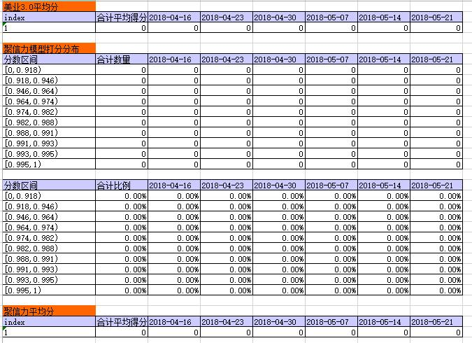
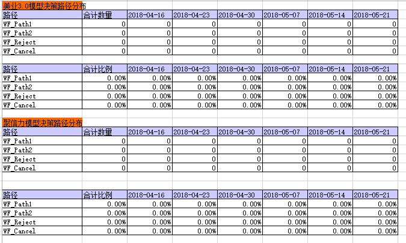
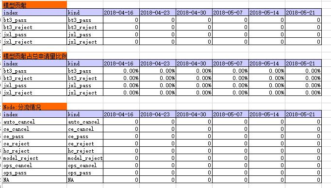

# 声明: This work (all contents of this folder) is only used by the author to summarize the work / project experience, reprint / spread is strictly prohibited
- Code has been deleted specific number / name

# 1 The output is excel as follows:
- specific number has been deleted

# 2 Project Objective:
Monitor the operation of the part of the weekly installment loan approval that is approved based on several automatic scoring models
Achieve a high degree of automation, only a small amount of necessary manual operations, automatically use the data in the database to output an intuitive and easy to understand excel form
And based on this, evaluate the performance of the strategy set in the approval according to several automatic scoring models, and the performance of these several automatic scoring models.
Adjust the strategy and model used as appropriate to achieve the stated objectives

# 3 Project meaning and difficulty

# 4 Project Insights
